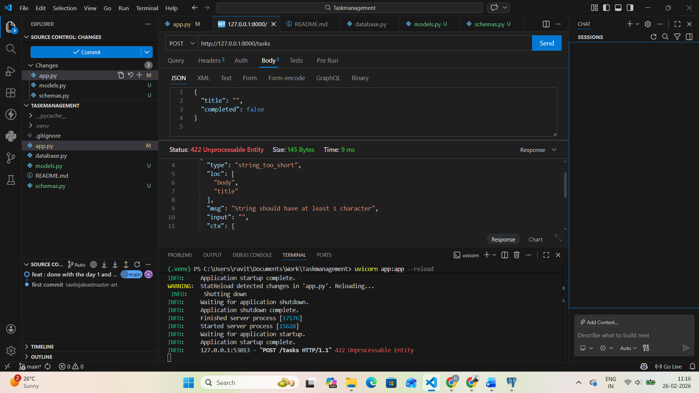

# Tasks Completed

 ## Day 1 — FastAPI Setup
1)	Created a FastAPI app that returns "Task Manager API running" at /.

2)	Create /health endpoint that returns { "status": "ok" }.

3)	Run the app using uvicorn with reload.

4)	Opened and test the Swagger and also the thunderclient.

## Day 2 — PostgreSQL Connection
1)	Install and setuped the  required packages for PostgreSQL and ORM.

2)	Create a PostgreSQL database named taskdb.

3)	Connect FastAPI to PostgreSQL using SQLAlchemy.

4)	Create a database session dependency.

5)	Test the DB connection with a simple /db-check endpoint.

## Day 3 - Tasks Model & Create 

1)	Created a SQLAlchemy Task table with fields:
    -	id
    -	title	
    -	completed
    -	created_at
2)	Created matching Pydantic schemas.
3)	Created POST /tasks to insert task into PostgreSQL.
4)	Validated title is required and not empty.
5)	Returned created task from database.

## proof of work

# Day 4 - Read, Update, Delete 

1)	Created GET /tasks to fetch all tasks from PostgreSQL.
2)	Created GET /tasks/{id} to fetch single task.
3)	Created PUT /tasks/{id} to update task.
4)	Created DELETE /tasks/{id} to delete task.
5)	Properly handled "task not found" with status codes.

# proof of work

## Delete_method

## Post method

